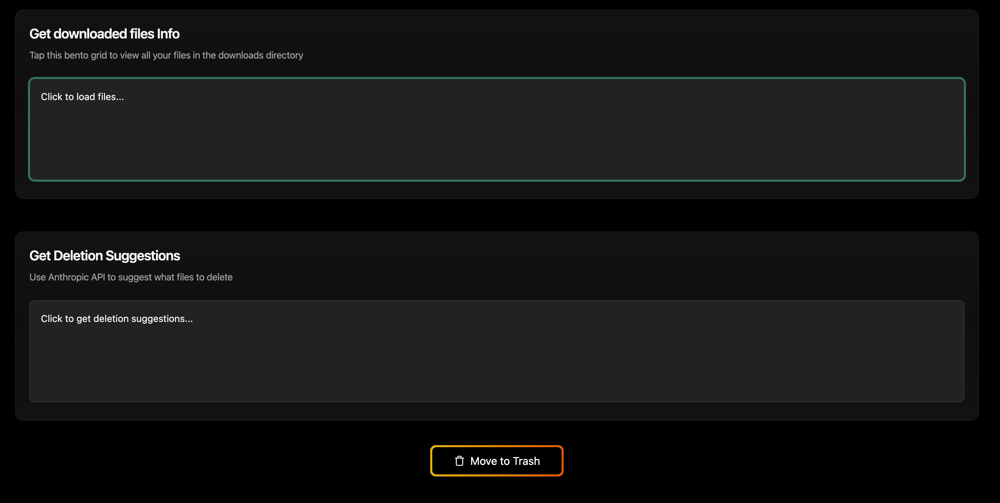

# Downloads Organizer

A local web app that helps you clean up your Downloads folder using AI. It scans your files, uses Claude AI to identify which ones are safe to delete, and lets you trash them in one click.

## What it does

- **Scans your Downloads folder**: lists all files with name, size, age, and type
- **AI-powered cleanup suggestions**: sends filenames to Claude, which identifies temporary files, logs, caches, backups, and junk (`.tmp`, `.log`, `.cache`, `.bak`, `.zip`, etc.)
- **One-click trash**: moves suggested files to your Trash with a single button
- **Move files**: relocate files to any folder on your machine

## Tech stack

- **Frontend**: React + Vite (TypeScript)
- **Backend**: FastAPI (Python) + Anthropic SDK

## Setup

### Prerequisites
- Node.js
- Python 3.11+
- An [Anthropic API key](https://console.anthropic.com/)

### Install

```bash
# Backend
cd backend
python -m venv venv
source venv/bin/activate
pip install -r requirements.txt

# Create a .env file in backend/
echo "ANTHROPIC_API_KEY=your_key_here" > .env

# Frontend
cd ../frontend
npm install
```

### Run

```bash
# From the project root
npm run dev
```

Opens at [http://localhost:5173](http://localhost:5173). Backend runs on port 8000.
